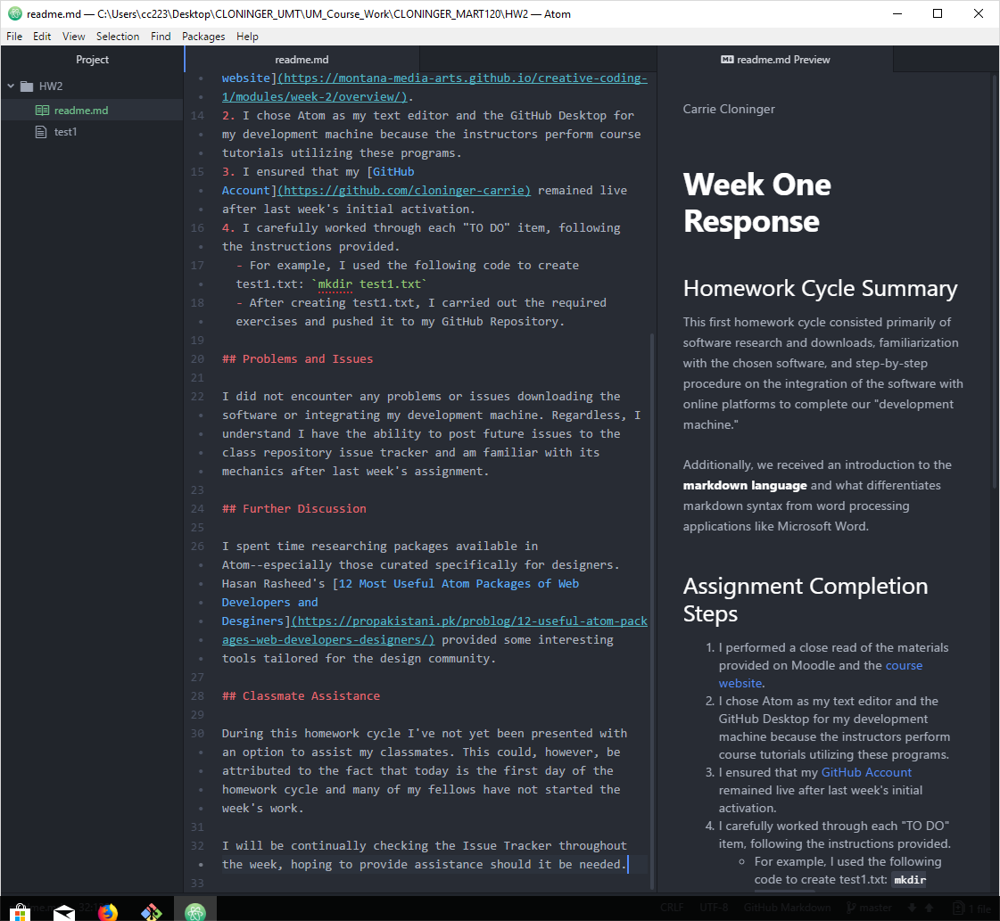

Carrie Cloninger

# **Week One Response**

## Homework Cycle Summary

This first homework cycle consisted primarily of software research and downloads, familiarization with the chosen software, and step-by-step procedure on the integration of the software with online platforms to complete our "development machine."

Additionally, we received an introduction to the **markdown language** and what differentiates markdown syntax from word processing applications like Microsoft Word.

## Assignment Completion Steps

1. I performed a close read of the materials provided on Moodle and the [course website](https://montana-media-arts.github.io/creative-coding-1/modules/week-2/overview/).
2. I chose Atom as my text editor and the GitHub Desktop for my development machine because the instructors perform course tutorials utilizing these programs.
3. I ensured that my [GitHub Account](https://github.com/cloninger-carrie) remained live after last week's initial activation.
4. I carefully worked through each "TO DO" item, following the instructions provided.
  - For example, I used the following code to create test1.txt: `mkdir test1.txt`
  - After creating test1.txt, I carried out the required exercises and pushed it to my GitHub Repository.

## Problems and Issues

I did not encounter any problems or issues downloading the software or integrating my development machine. Regardless, I understand I have the ability to post future issues to the class repository issue tracker and am familiar with its mechanics after last week's assignment.

## Further Discussion

I spent time researching packages available in Atom--especially those curated specifically for designers. Hasan Rasheed's [12 Most Useful Atom Packages of Web Developers and Desginers](https://propakistani.pk/problog/12-useful-atom-packages-web-developers-designers/) provided some interesting tools tailored for the design community.

## Classmate Assistance

During this homework cycle I've not yet been presented with an option to assist my classmates. This could, however, be attributed to the fact that today is the first day of the homework cycle and many of my fellows have not started the week's work.

I will be continually checking the Issue Tracker throughout the week, hoping to provide assistance should it be needed.

01.30.2018 UPDATE: Responded to user ClarissaSpain regarding issue with uploading images in text editor.

## Image of My Text Editor

